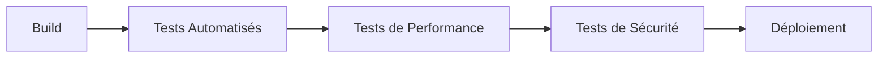

# Introduction au Plan de Tests

Ce document présente le cadre et les objectifs de la stratégie de tests pour notre plateforme de gestion d'abonnements. Il définit les standards de qualité et détaille les processus à suivre pour garantir une application robuste, performante et sécurisée.

---

## 1. Contexte du Projet

Notre application est composée de plusieurs modules interconnectés :

- **Frontend** : Développé avec **Nuxt.js 3**
- **Backend** : Construit avec **AdonisJS**
- **Base de données** : Utilise **PostgreSQL**
- **Système de paiement** : Intégré avec **Stripe**

---

## 2. Objectifs du Plan de Tests

Les tests visent à assurer :

### 2.1 Qualité du Code
- **Couverture maximale** : Assurer 100% de couverture sur le code critique.
- **Détection précoce** : Identifier rapidement les régressions pour éviter des problèmes en production.
- **Fiabilité** : Maintenir une base de code stable et évolutive.

### 2.2 Expérience Utilisateur
- **Parcours critiques** : Tester les flux essentiels (inscription, login, abonnement, paiement, etc.).
- **Performance** : Garantir une réponse rapide (temps de réponse <200ms pour 95% des requêtes) et un chargement initial <2s.
- **Sécurité** : Protéger l'application contre les attaques (injections, XSS, etc.) et assurer la confidentialité des données.

### 2.3 Maintenance
- **Facilité d'évolution** : Simplifier l'ajout de nouvelles fonctionnalités.
- **Débogage efficace** : Réduire le temps de correction des bugs grâce à une suite de tests complète.
- **Confiance en refactoring** : Permettre des modifications importantes sans risque de régression.

---

## 3. Stack Technique des Tests

### 3.1 Frontend
Configuration typique (extrait de `package.json`) :
```json
{
  "devDependencies": {
    "@vue/test-utils": "^2.4.0",
    "vitest": "^0.34.0",
    "cypress": "^13.0.0",
    "@cypress/vue": "^5.0.0"
  }
}
```

### 3.2 Backend
Configuration typique (extrait de `package.json`) :
```json
{
  "devDependencies": {
    "@japa/runner": "^2.5.0",
    "@japa/spec-reporter": "^1.3.0",
    "supertest": "^6.3.0",
    "artillery": "^2.0.0"
  }
}
```

---

## 4. Métriques de Qualité

### 4.1 Couverture de Code
- **Frontend** : > 90% global (100% sur les composants critiques)
- **Backend** : > 95% global (100% sur contrôleurs et services)
- **E2E** : Couvre les principaux parcours utilisateur

### 4.2 Performance
- **API** : Temps de réponse <200ms pour 95% des requêtes
- **Lighthouse** : Score >90 pour Performance, Accessibility, Best Practices
- **Chargement** : Temps de chargement initial <2s

### 4.3 Sécurité
- **OWASP Top 10** : Tests pour chaque vulnérabilité critique
- **Audit** : 0 vulnérabilité critique détectée dans les dépendances
- **Injection** : Couverture complète des points d'entrée sensibles

---

## 5. Processus de Test

### 5.1 Cycle de Développement


### 5.2 Pipeline de Déploiement


---

## 6. Évolution et Maintenance

### 6.1 Mise à Jour Régulière
- **Revue mensuelle** : Évaluer et ajuster les tests.
- **Mise à jour des dépendances** : Toujours utiliser les versions stables et sécurisées.
- **Optimisation** : Améliorer en continu la suite de tests pour réduire les temps d'exécution.

### 6.2 Documentation et Standards
- **Exemples concrets** : Fournir des guides et des exemples de tests pour chaque type.
- **Guide de contribution** : Définir les règles de qualité et les standards à respecter.
- **Documentation évolutive** : Mettre à jour régulièrement les pratiques et outils utilisés.

---

## 7. Formation

### 7.1 Nouveaux Développeurs
- **Formation initiale** : Initiation aux outils de test et au processus global.
- **Guides et tutoriels** : Documentation détaillée et exemples pratiques.
- **Mentorat** : Accompagnement lors des premiers tests.

### 7.2 Équipe Existante
- **Ateliers de perfectionnement** : Sessions régulières pour améliorer les pratiques de test.
- **Revue de code dédiée** : Focus sur la qualité des tests lors des revues de code.
- **Partage de connaissances** : Mise en place de sessions de partage et de feedback.

---

## 8. Prochaines Étapes

### Court Terme
- Mettre en place l'infrastructure de tests.
- Former l'équipe aux outils et aux processus.
- Rédiger les premiers tests critiques.

### Moyen Terme
- Augmenter progressivement la couverture de tests.
- Automatiser complètement l'exécution des tests (CI/CD).
- Optimiser les tests pour réduire les temps d'exécution.

### Long Terme
- Maintenir la suite de tests à jour et pertinente.
- Adapter les stratégies de tests aux évolutions du projet.
- Assurer une formation continue et une veille technologique.

---

Ce document offre une vision globale et détaillée du plan de tests, incluant les objectifs, la stack technique, les métriques de qualité, le processus et les étapes d'évolution. Il servira de référence pour assurer la qualité, la performance et la sécurité de notre application, tout en facilitant la maintenance et l'évolution du code. 